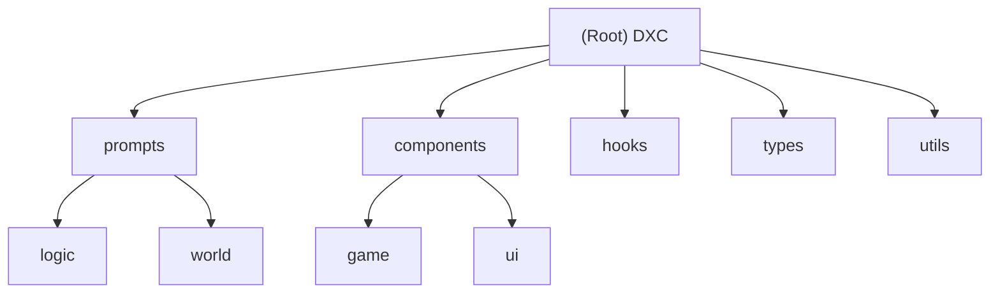

# Aha Loop - DXC Project Guide

> Update 2026-02-03: Refreshed documentation structure, added module graph and detailed indices.

## Project Vision
**DXC** is an immersive AI text adventure / Dungeon Master system set in the "DanMachi" (Is It Wrong to Try to Pick Up Girls in a Dungeon?) universe.
It features a strict **Narrative/Command Separation** protocol (JSON), separating story text (`logs`) from game state updates (`tavern_commands`). The system uses Google Gemini for narrative generation, world event simulation, and player interaction.

## Architecture Overview
- **Frontend**: React 19 + Vite (TypeScript), Tailwind CSS 4, Framer Motion.
- **AI Core**: `@google/genai` (Gemini) with a modular prompt engineering system.
- **State Management**: React Hooks (`useGameLogic`) + strict JSON protocol from AI.
- **Styling**: Custom "Hestia Blue" theme, glassmorphism, "Familia Myth" visual style.

### Module Structure


## Module Index

| Path | Description | Tech/Key Files |
|------|-------------|----------------|
| `prompts/` | **AI Instructions Core**. Contains system rules, world lore, and logic definitions. | `index.ts`, `system.ts`, `logic.ts` |
| `components/` | **UI Library**. Game interface, modals, and presentational components. | `game/`, `ui/`, `modals/` |
| `hooks/` | **Game Logic**. State management and custom hooks. | `useGameLogic.ts` |
| `types/` | **Type Definitions**. TypeScript interfaces for game state and entities. | `types.ts`, `story.ts` |
| `utils/` | **Utilities**. AI integration, data mapping, and helper functions. | `ai.ts`, `dataMapper.ts` |

## Development & Testing

### Setup
```bash
npm install
# Configure .env.local with GEMINI_API_KEY=...
```

### Run
```bash
npm run dev      # Start dev server at http://localhost:3000
npm run build    # Build for production
npx tsc --noEmit # Type checking
```

### Testing Strategy
- **Manual Testing**: Due to the AI-driven nature, gameplay testing involves verifying AI response parsing and state updates.
- **Type Safety**: Rely heavily on TypeScript strict mode.
- **Prompt Testing**: Modify `prompts/` and verify AI behavior in the "Preview" or dev mode.

## Coding Standards
- **UI Style**: Follow "DanMachi" aesthetic (blue/white/gold schemes, distinct borders). Use Tailwind utility classes.
- **State Logic**: Keep complex logic in `hooks/` or `utils/`. Components should remain presentational where possible.
- **AI Protocol**: Never break the `tavern_commands` JSON structure. All state changes must come via valid AI commands.
- **File Naming**: PascalCase for React components (`FamiliaModal.tsx`), camelCase for utilities (`itemUtils.ts`).

## AI Usage Guidelines
- **Modifying Behavior**: To change game rules, edit `prompts/` files, not just TS code.
- **New Features**: When adding a feature (e.g., Blacksmith), add both the UI component AND the corresponding `prompts/` module to teach the AI about it.

## Changelog
- **2026-02-03**: Documentation refresh. Mapped `prompts` and `components` modules. Added Mermaid graph.
